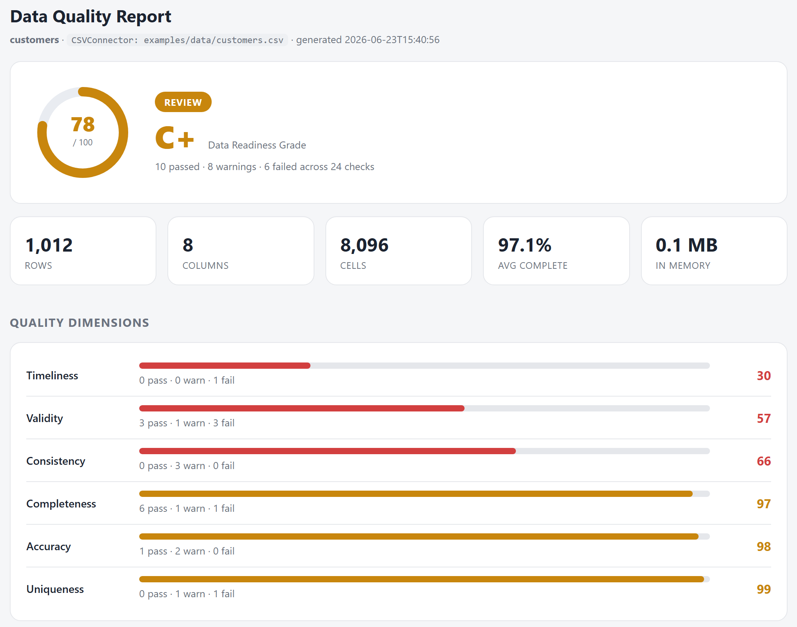

# Data Quality Engine

> Automated data quality assessment: ingest a dataset, run a battery of quality
> checks, and get back a **data-readiness score** plus a shareable report — so
> you catch bad data *before* it reaches a model.

Most ML projects don't fail at the model. They fail at the data: silent nulls, a
botched join that duplicated half the rows, a category that drifted, a column
that's secretly constant. This engine makes those problems visible and
quantifies them into a single 0–100 readiness grade.

**App 1 of a 5-part data science portfolio** (quality → modeling → dashboard →
monitoring → integration).



> The HTML report above was generated from a synthetic dataset broken in 8
> deliberate ways — the engine caught every one and scored it 78/100 (Grade C+,
> verdict: REVIEW). See [`docs/report-findings.png`](docs/report-findings.png)
> for the full findings list.

---

## What it does

- **Ingests from anywhere** — CSV/TSV, Excel, and Parquet out of the box, with a
  one-method connector interface and working **SQL** and **REST API**
  extension points.
- **Runs 9 checks across 6 quality dimensions** — completeness, uniqueness,
  validity, consistency, accuracy, and timeliness.
- **Scores readiness** — every check rolls up into a weighted, transparent
  0–100 score with a letter grade and a `READY / REVIEW / NOT READY` verdict.
- **Reports two ways** — a machine-readable **JSON** report for pipelines and a
  self-contained **HTML** report (no server, no CDN) that screenshots cleanly
  for stakeholders.
- **Gates CI** — the CLI exit code reflects the verdict, so you can block a
  pipeline on data that isn't ready.

## Quick start

```bash
cd data-quality-engine
pip install -r requirements.txt

# 1. Generate a deliberately messy demo dataset
python examples/generate_sample_data.py

# 2. Assess it (with domain rules from the example config)
python -m dqe assess examples/data/customers.csv --config config.example.yaml

# 3. Open the report
#    reports/customers.html   (visual)
#    reports/customers.json   (machine-readable)
```

Assess any file with zero config — the checks that need rules just stay dormant:

```bash
python -m dqe assess path/to/your.csv
```

## The checks

| Check | Dimension | What it catches |
|---|---|---|
| `completeness` | Completeness | Missing / null values, per column |
| `duplicate_rows` | Uniqueness | Fully duplicated rows |
| `primary_key` | Uniqueness | Key collisions (configurable key) |
| `schema` | Validity | Missing columns, dtype drift, unexpected columns |
| `allowed_values` | Validity | Categories outside an allowed set |
| `constant_columns` | Consistency | Zero-information / all-null columns |
| `range` | Consistency | Values outside business min/max |
| `outliers` | Accuracy | Statistical outliers (IQR or z-score) |
| `freshness` | Timeliness | Stale data vs a max-age threshold |

Run `python -m dqe list-checks` to see them live.

## How scoring works

```
check score  →  mean within a dimension  →  dimension score
dimension scores  →  weighted mean  →  overall readiness (0–100)  →  grade
```

Dimension weights live in [`dqe/types.py`](dqe/types.py) (`DIMENSION_WEIGHTS`).
Only dimensions that actually produced results count, so not configuring a
freshness check never penalises the score. The whole rollup is deliberately
simple enough to explain to a stakeholder in one breath.

## Architecture

```
dqe/
├── connectors/     # source → DataFrame (csv/excel/parquet, sql/api extension points)
├── checks/         # one file per dimension; each check self-registers
├── profiling.py    # per-column stats, computed once and shared
├── scoring.py      # results → dimension scores → readiness grade
├── engine.py       # orchestration: load → profile → check → score
├── report.py       # JSON + self-contained HTML
└── cli.py          # `dqe assess`
```

The design goal is **extensibility without edits**: add a connector by
subclassing `Connector`; add a check by writing a class and decorating it with
`@register`. The engine discovers both automatically.

## Use as a library

```python
from dqe import assess

report = assess("data.csv", config={"checks": {"primary_key": {"key": ["id"]}}})
print(report.scorecard.overall_score, report.scorecard.grade)
for finding in report.findings:
    print(finding.status.value, finding.message)
```

## Configuration

All behaviour is driven by an optional YAML/JSON config — thresholds, expected
schema, primary key, value ranges, allowed categories, freshness window. See
[`config.example.yaml`](config.example.yaml) for a fully-commented example.

## Tests

```bash
pip install pytest
pytest -q
```

## Roadmap (other portfolio apps)

This is App 1. It produces the clean, validated data that feeds:

2. **Model Development & Comparison Framework**
3. **Interactive Stakeholder Dashboard**
4. **Production Monitoring & Observability**
5. **End-to-end integration**
